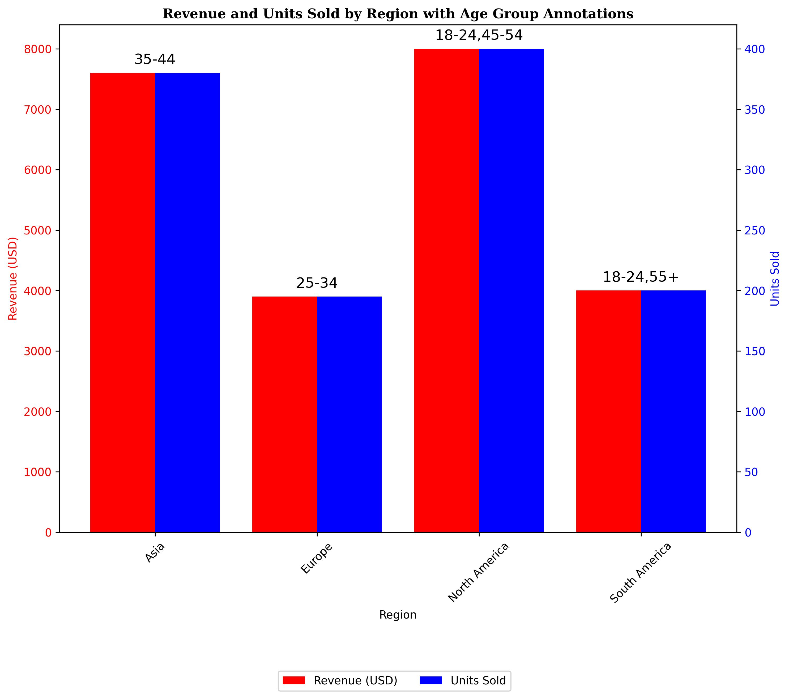

# Grouped Data Analysis with Pandas and Matplotlib

## Project Summary 
This project analyzes sales data by grouping it by region using pandas, visualizes results with a dual-axis matplotlib chart (Revenue vs. Units Sold), and exports to an Excel file with openpyxl.  
This project helps analyze sales data for better data-driven-decision-making.

## Requirements
- `pandas`
- `numpy`
- `matplotlib`
- `openpyxl`

Install with:  
```bash
pip install pandas numpy matplotlib openpyxl
```
## How to Run


Clone the repo:
```bash
git clone https://github.com/EngrProsper/Grouped-data-with-pandas-and-matplotlib-.git
```

Open data_grouping.ipynb in Colab:
```bash https://colab.research.google.com/drive/14bwT_xp6XVVeVI-GfP0MfienimpmBYtk#scrollTo=Yc-DdLEXnrVJ
```

Run all cells to generate data, chart, and Excel (project_grouped_data.xlsx).
## Results
Groups data by Region with summed Revenue and Units Sold.
Displays a bar chart with age group annotations.
Exports to Excel with an embedded chart.


## Example output for chart
This chart compares total revenue and unit sold across regions providing a clear visual relationship between sales performance and   quantity 

Download the generated Excel file:
[project_grouped_data.xlsx](project_grouped_data.xlsx)

## This project is licensed under the
[MIT License](LICENSE)

## Author 
Created by Prosper Ochuko as a weekly learning project for freelancing.
